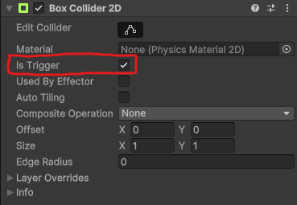

# Znajdźki

Monety rozrzucone po poziomach, które nagradzają gracza za pokazanie swoich umiejętności platformingowych.

## Technicznie

Znajdźka jest bardzo prostym obiektem w grze posiadającym `Trigger` czyli specjalny tryb `Collider`a, wywołujący inny rodzaj zdarzeń.



Triggery wywołują zestaw metod:

- `OnTriggerEnter(Collider other)`
- `OnTriggerStay(Collider other)`
- `OnTriggerExit(Collider other)`

Aby dostać się do komponentu `GameObject` obiektu `other` wystarczy, że skorzystamy z zawsze dostęnej zmiennej:

```csharp
other.gameObject
```

W jaki sposób można opisać zależności między graczem, a znajdźką?

```text
Gracz -- OnTriggerEnter --> Znajdźka
Gracz -- wywołuje --> Collect() na znajdźce
Znajdźka --> nagradza gracza punktami
```

> Uwaga!
>
> Aby system fizyczny wykrył kolizję, jeden z obiektów kolidujących musi mieć na sobie komponent `Rigidbody`!
